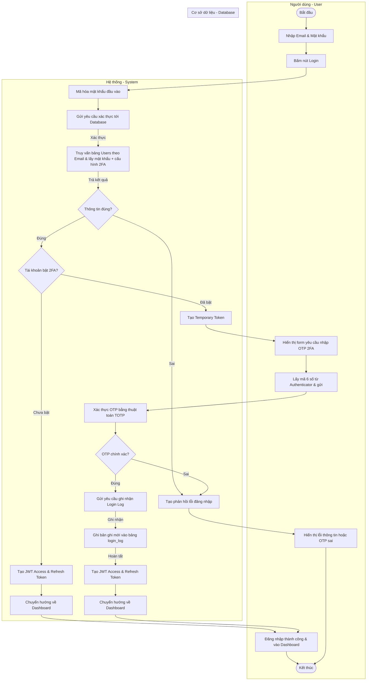
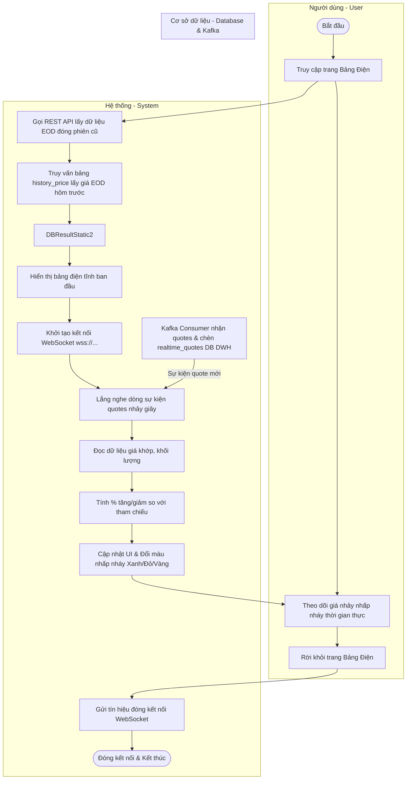
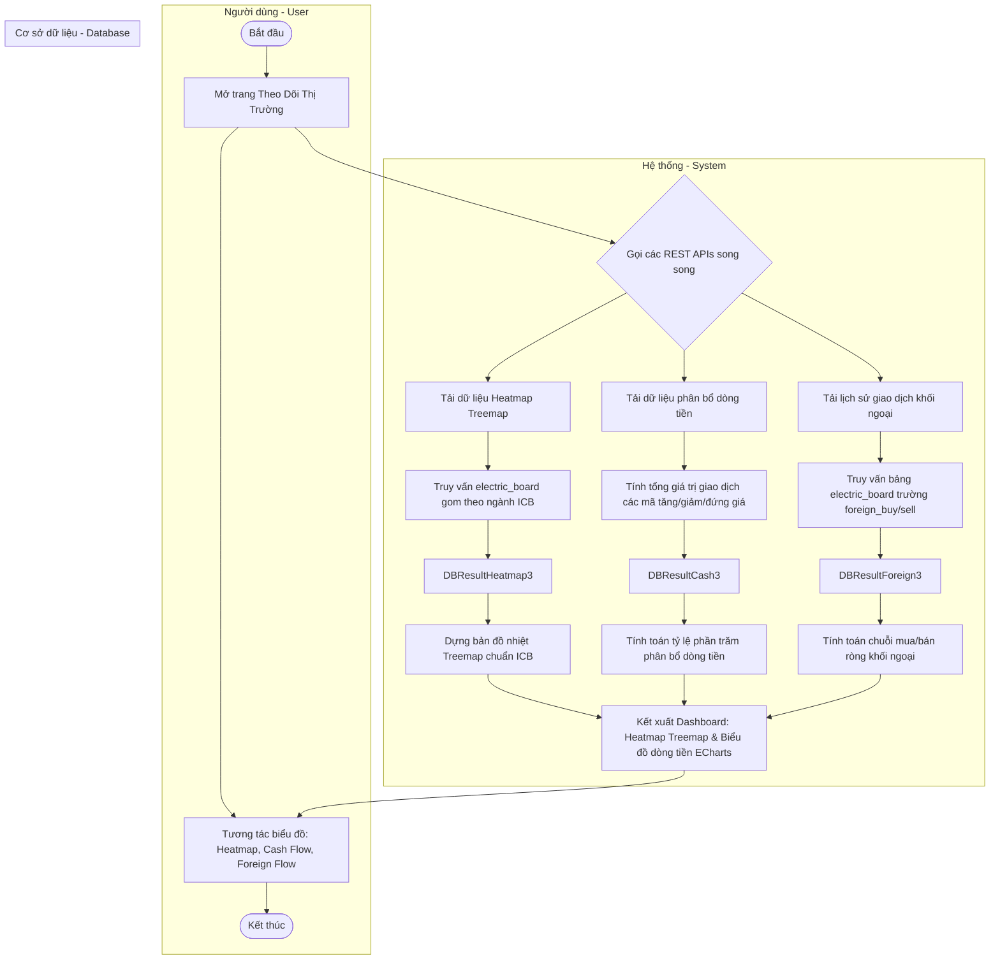
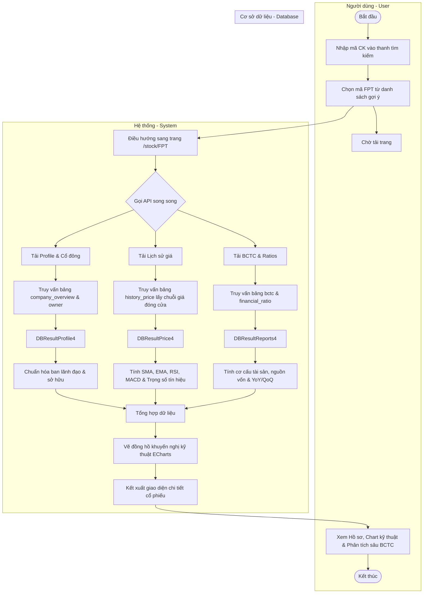
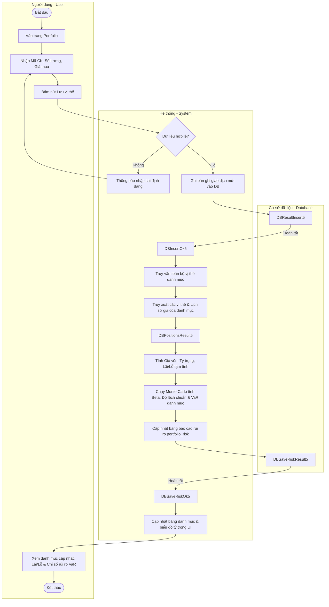
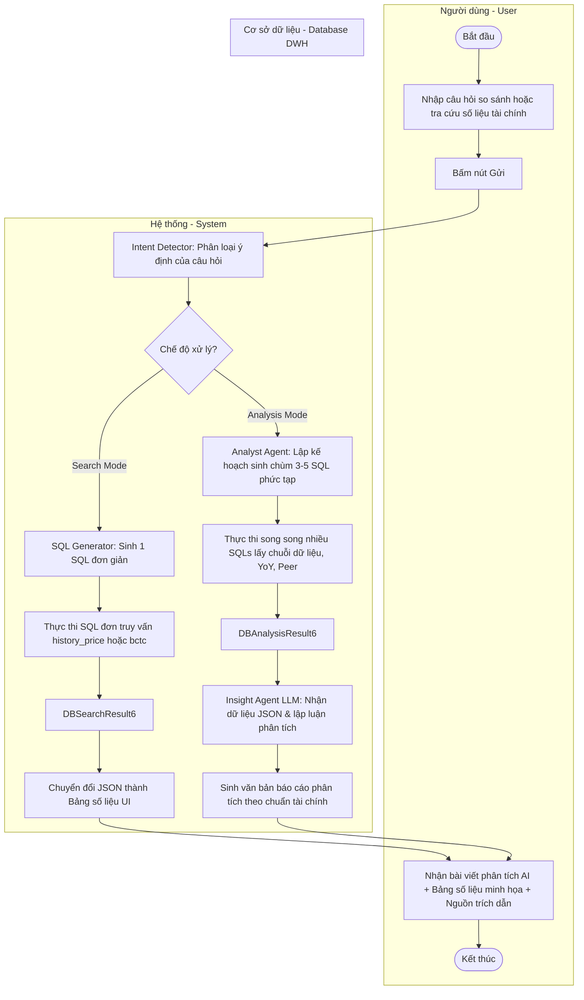
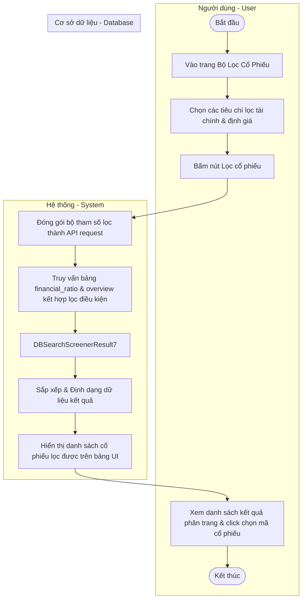
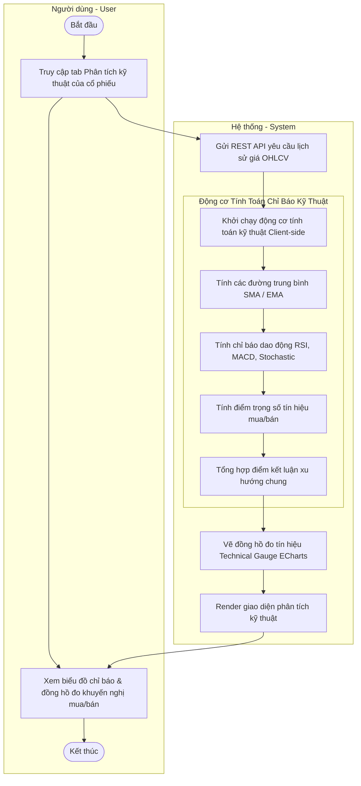
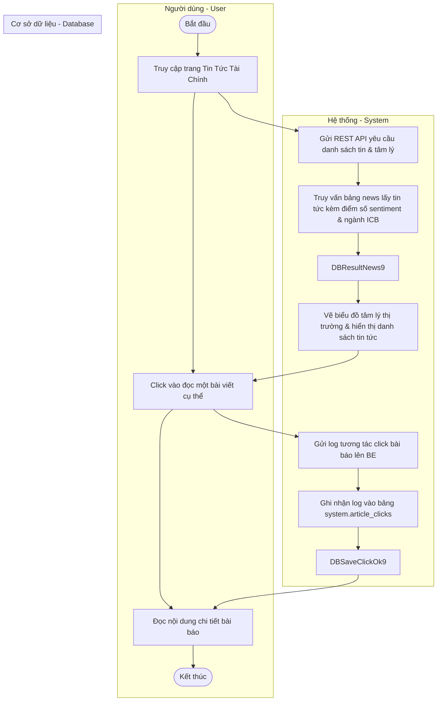
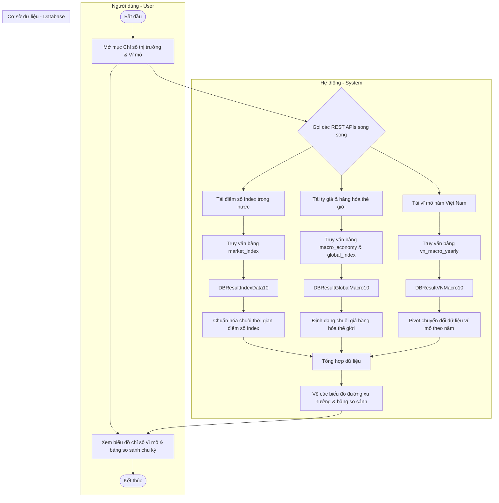

# 📐 TÀI LIỆU BIỂU ĐỒ HOẠT ĐỘNG (ACTIVITY DIAGRAMS)

Tài liệu này mô tả chi tiết luồng nghiệp vụ (Business Logic) và các bước xử lý tương tác giữa **Người dùng (User)**, **Hệ thống (System)** và **Cơ sở dữ liệu (Database)** dưới góc nhìn của một Chuyên gia phân tích nghiệp vụ (Business Analyst).

Các biểu đồ hoạt động dưới đây được xây dựng dưới dạng **Activity Diagram có phân làn (Swimlanes)** bằng mã nguồn **Mermaid** tương ứng với 10 use case cốt lõi trong hệ thống phân tích chứng khoán Việt Nam.

---

## 1. Module Xác Thực Người Dùng & TOTP 2FA (Authentication & TOTP 2FA)

### Luồng Nghiệp Vụ Chi Tiết (Document)
*   **User (Người dùng):** Bắt đầu. Nhập địa chỉ Email và Mật khẩu trên giao diện đăng nhập, sau đó bấm nút **Login**.
*   **System (Hệ thống BE):** Tiếp nhận thông tin đăng nhập, mã hóa mật khẩu đầu vào (hashing) và gửi yêu cầu xác thực sang Database.
*   **Database (Cơ sở dữ liệu):** Thực hiện tìm kiếm thông tin tài khoản người dùng theo email và so khớp mật khẩu đã mã hóa. Trả về trạng thái xác thực và trạng thái cấu hình 2FA (True/False, Has_2FA).
*   **System (Hệ thống BE):** Nhận kết quả từ Database:
    *   *Trường hợp 1 (Thông tin sai):* Trả về thông báo lỗi đăng nhập hiển thị trên màn hình User.
    *   *Trường hợp 2 (Đúng thông tin & Chưa bật 2FA):* Sinh mã JWT Access/Refresh Token, gửi phản hồi thành công và chuyển hướng người dùng về trang Dashboard.
    *   *Trường hợp 3 (Đúng thông tin & Đã bật 2FA):* Sinh mã token tạm thời (Temporary Token) và hiển thị form yêu cầu nhập mã OTP (2FA).
*   **User (Người dùng):** (Nếu thuộc trường hợp 3) Mở ứng dụng Google Authenticator, lấy mã OTP gồm 6 chữ số, điền vào form và bấm **Xác nhận**.
*   **System (Hệ thống BE):** Nhận mã OTP, kiểm tra tính hợp lệ sử dụng thuật toán TOTP. Gửi lệnh lưu log đăng nhập sang Database.
*   **Database (Cơ sở dữ liệu):** Lưu vết lịch sử đăng nhập thành công của người dùng.
*   **System (Hệ thống BE):** Trả về JWT Access/Refresh Token chính thức và điều hướng người dùng tới Dashboard.
*   **User (Người dùng):** Nhận phản hồi thành công trên màn hình, truy cập Dashboard. Kết thúc luồng.

### Mã Nguồn Biểu Đồ (Mermaid Code)

---

## 2. Module Bảng Điện Chứng Khoán Thời Gian Thực (Real-time Price Board)

### Luồng Nghiệp Vụ Chi Tiết (Document)
*   **User (Người dùng):** Bắt đầu. Truy cập vào giao diện Bảng điện trực tuyến (Price Board).
*   **System (Hệ thống FE/BE):** 
    1. Gọi REST API gửi yêu cầu lấy dữ liệu tĩnh đóng phiên gần nhất (giá đóng cửa cũ, giá tham chiếu, giá trần, sàn) để render nhanh giao diện bảng điện ban đầu.
    2. Khởi tạo kết nối **WebSocket** (`ws://...`) đến Server BE để đăng ký nhận dòng thông tin nhảy giá thời gian thực (quotes).
*   **Database (Cơ sở dữ liệu):** Nhận yêu cầu REST API, truy xuất giá EOD và trả về kết quả cho Hệ thống.
*   **System (Hệ thống FE/BE):** Render kết cấu bảng điện ban đầu cho người dùng. Bắt đầu lắng nghe gói tin WebSocket chứa dữ liệu khớp lệnh nhảy giây từ Kafka Broker.
*   **Database (Cơ sở dữ liệu / Kafka Broker):** Kafka broker nhận message thô từ websocket producer, consumer đồng bộ chèn vào bảng `realtime_quotes` trong DWH, đồng thời đẩy sự kiện quote thời gian thực về phía Hệ thống.
*   **System (Hệ thống FE/BE):** Nhận gói tin quotes, tính toán mức chênh lệch giá, cập nhật tự động các số liệu trên màn hình bảng điện và đổi màu nhấp nháy (Xanh: tăng, Đỏ: giảm, Vàng: đứng giá).
*   **User (Người dùng):** Theo dõi diễn biến bảng điện nhảy tự động. Bấm tắt/rời bảng điện để hoàn thành.
*   **System (Hệ thống FE/BE):** Phát hiện sự kiện unmount giao diện, kích hoạt gửi tín hiệu đóng kết nối WebSocket để giải phóng tài nguyên. Kết thúc luồng.

### Mã Nguồn Biểu Đồ (Mermaid Code)

---

## 3. Module Theo Dõi & Phân Tích Thị Trường (Market Dashboard & Cash Flow)

### Luồng Nghiệp Vụ Chi Tiết (Document)
*   **User (Người dùng):** Bắt đầu. Truy cập vào trang Theo dõi/Phân tích thị trường (Market Dashboard) để phân tích dòng tiền.
*   **System (Hệ thống FE/BE):** Gửi các yêu cầu REST API song song để lấy thông số tổng quan thị trường: Bản đồ nhiệt (Heatmap), phân bổ dòng tiền (Cash Flow), tác động chỉ số (Index Impact), và dòng tiền khối ngoại (Foreign Flow).
*   **Database (Cơ sở dữ liệu):** Nhận yêu cầu, quét dữ liệu thống kê từ các bảng `electric_board`, `history_price` và `company_overview`. Thực hiện tính toán gộp (Aggregation) và trả về kết quả JSON.
*   **System (Hệ thống FE/BE):** Nhận kết quả và xử lý trực quan hóa:
    - *Heatmap:* Dựng bản đồ nhiệt Treemap trực quan, phân rã theo ngành cấp 1, cấp 2 và từng mã cổ phiếu (kích thước ô đại diện cho thanh khoản, màu sắc đại diện cho % biến động giá).
    - *Cash Flow:* Tính tỷ lệ phần trăm GTGD đổ vào các mã tăng, giảm, hoặc không đổi.
    - *Index Impact:* Xác định danh sách top cổ phiếu đóng góp số điểm nhiều nhất vào chỉ số VN-Index.
    - *Foreign Flow:* Lập chuỗi mua ròng/bán ròng của khối ngoại.
    Render toàn bộ các biểu đồ ECharts lên màn hình.
*   **User (Người dùng):** Xem các biểu đồ tương tác dòng tiền, click chọn một nhóm ngành trên bản đồ nhiệt để đi sâu phân tích hoặc rời trang. Kết thúc luồng.

### Mã Nguồn Biểu Đồ (Mermaid Code)

---

## 4. Module Tra Cứu & Phân Tích Cổ Phiếu Chuyên Sâu (Stock Analysis)

### Luồng Nghiệp Vụ Chi Tiết (Document)
*   **User (Người dùng):** Bắt đầu. Gõ mã cổ phiếu (Ví dụ: `FPT`) trên thanh tìm kiếm thông minh và chọn mã tương ứng từ danh sách gợi ý.
*   **System (Hệ thống FE/BE):** Nhận mã chứng khoán, thực hiện điều hướng URL sang trang chi tiết cổ phiếu `/stock/FPT`. Kích hoạt gửi 3 yêu cầu API song song:
    1. Tải hồ sơ doanh nghiệp & ban lãnh đạo (Profile).
    2. Tải chuỗi giá đóng cửa lịch sử phục vụ biểu đồ phân tích kỹ thuật (Price History).
    3. Tải báo cáo tài chính thô qua các quý/năm (Financial Reports).
*   **Database (Cơ sở dữ liệu):** Nhận các yêu cầu truy vấn song song, quét dữ liệu từ các bảng `company_overview`, `history_price`, `bctc` và `financial_ratio` dựa trên khóa `ticker = 'FPT'`. Trả về kết quả JSON cho Hệ thống.
*   **System (Hệ thống FE/BE):** Tiếp nhận dữ liệu phản hồi và tiến hành tính toán nghiệp vụ tại Client:
    - *Vẽ Chart:* Chuyển đổi dữ liệu chuỗi giá sang nến OHLCV và tính toán các chỉ báo kỹ thuật SMA, EMA, RSI, MACD.
    - *Khuyến nghị:* Chấm điểm tín hiệu mua/bán từ các chỉ báo kỹ thuật, render ECharts Technical Gauge.
    - *Phân tích sâu BCTC:* Tính toán breakdown cơ cấu tài sản, nguồn vốn và tỷ lệ tăng trưởng YoY/QoQ.
    - Giao diện được hiển thị đầy đủ cho người dùng.
*   **User (Người dùng):** Xem chi tiết thông số cổ phiếu, tương tác zoom/pan trên biểu đồ phân tích kỹ thuật hoặc xem báo cáo tài chính dọc của doanh nghiệp. Kết thúc luồng.

### Mã Nguồn Biểu Đồ (Mermaid Code)

---

## 5. Module Quản Lý Danh Mục & Tính Toán Rủi Ro (Portfolio Transactions & Risk)

### Luồng Nghiệp Vụ Chi Tiết (Document)
*   **User (Người dùng):** Bắt đầu. Truy cập trang quản lý danh mục cá nhân, bấm **Thêm giao dịch** (nhập Mã CK, Số lượng, Giá mua). Bấm nút **Lưu vị thế**.
*   **System (Hệ thống FE/BE):** Tiếp nhận thông số giao dịch, kiểm tra tính hợp lệ của dữ liệu đầu vào (khối lượng phải là số nguyên dương, giá trị số thực lớn hơn 0). Gửi yêu cầu lưu trữ thông tin giao dịch sang Database.
*   **Database (Cơ sở dữ liệu):** Ghi nhận thông tin giao dịch mới vào bảng vị thế giao dịch của người dùng trong DWH, trả về trạng thái lưu thành công.
*   **System (Hệ thống FE/BE):** 
    1. Gọi REST API cập nhật lấy toàn bộ vị thế hiện tại của danh mục, đồng thời lấy giá thị trường thời gian thực của các mã đang nắm giữ.
    2. Thực hiện tính toán lại Giá vốn trung bình, Tỷ trọng tài sản của từng mã trong danh mục và Lãi/Lỗ tạm tính (P/L).
    3. Gửi yêu cầu chạy module Phân tích định lượng để tính toán Beta danh mục, Độ lệch chuẩn tỷ suất sinh lời và giá trị chịu rủi ro (VaR - Value at Risk) thông qua mô phỏng Monte Carlo.
*   **Database (Cơ sở dữ liệu):** Lưu trữ kết quả báo cáo rủi ro danh mục mới được cập nhật vào PostgreSQL.
*   **System (Hệ thống FE/BE):** Trả về toàn bộ dữ liệu danh mục đầu tư đã tính toán và cập nhật giao diện Dashboard của người dùng.
*   **User (Người dùng):** Nhận báo cáo vị thế cập nhật mới kèm các chỉ số rủi ro trực quan trên biểu đồ tròn tỷ trọng. Kết thúc luồng.

### Mã Nguồn Biểu Đồ (Mermaid Code)

---

## 6. 🤖 Hệ Thống RAG Chatbot AI (Search & Analysis Agent Workflow)

### Luồng Nghiệp Vụ Chi Tiết (Document)
*   **User (Người dùng):** Bắt đầu. Nhập câu hỏi truy vấn dữ liệu tài chính (Ví dụ: *"So sánh biên lợi nhuận gộp của FPT và MWG trong năm 2025"*) và bấm gửi.
*   **System (Hệ thống Chatbot BE):** 
    1. Tiền xử lý câu hỏi và chuyển qua **Router (Bộ định tuyến ý định)**.
    2. Router thực hiện phân loại ý định:
        - *Nhánh 1: Search Mode (Fast-path)*: Dùng để hỏi đáp số liệu nhanh. Sinh câu lệnh SQL tĩnh đơn giản.
        - *Nhánh 2: Analysis Mode (Agentic-path)*: Dùng để yêu cầu phân tích sâu, so sánh đối thủ hoặc vĩ mô. Kích hoạt Analyst Agent để lập kế hoạch lấy dữ liệu, sinh đồng thời nhiều câu lệnh SQL phức tạp (YoY, QoQ, Industry comparison).
    3. Gửi câu lệnh SQL sang Database để thực thi.
*   **Database (Cơ sở dữ liệu):** Nhận các câu lệnh SQL, thực thi truy vấn trên các bảng dữ liệu của schema `hethong_phantich_chungkhoan` (DWH) và trả về kết quả dưới dạng JSON cho Hệ thống.
*   **System (Hệ thống Chatbot BE):** 
    - Đối với *Search Mode*: Chuyển đổi dữ liệu JSON thô thành bảng số liệu trực quan và trả về trực tiếp cho giao diện người dùng.
    - Đối với *Analysis Mode*: Chuyển tiếp kết quả JSON kèm theo System Prompt chuyên sâu sang **Insight Agent / Financial Analyst LLM**. LLM đọc hiểu dữ liệu, lập luận, so sánh tương đối và sinh văn bản báo cáo phân tích có cấu trúc Markdown hoàn chỉnh.
*   **User (Người dùng):** Nhận được phản hồi hiển thị trên màn hình chat (bao gồm: bài phân tích lập luận sâu sắc từ AI, bảng dữ liệu đối chứng đi kèm và các nguồn trích dẫn dữ liệu đáng tin có đầy đủ). Kết thúc luồng.

### Mã Nguồn Biểu Đồ (Mermaid Code)

---

## 7. Module Bộ Lọc Cổ Phiếu (Stock Screener)

### Luồng Nghiệp Vụ Chi Tiết (Document)
*   **User (Người dùng):** Bắt đầu. Truy cập trang Bộ lọc cổ phiếu (Stock Screener), chọn các tiêu chí lọc (Ví dụ: P/E < 15, ROE > 15%, Vốn hóa > 1,000 tỷ). Bấm nút **Lọc cổ phiếu**.
*   **System (Hệ thống FE/BE):** Tiếp nhận các điều kiện lọc từ giao diện, đóng gói tham số lọc gửi REST API request lên Backend Server.
*   **Database (Cơ sở dữ liệu):** Nhận truy vấn, thực hiện tìm kiếm trên các bảng `financial_ratio` và `company_overview` để lọc ra danh sách các mã cổ phiếu thỏa mãn đầy đủ các tiêu chí thiết lập. Trả về kết quả JSON.
*   **System (Hệ thống FE/BE):** Nhận kết quả từ Database, phân loại và sắp xếp dữ liệu, render bảng kết quả phân trang lên giao diện người dùng.
*   **User (Người dùng):** Xem danh sách cổ phiếu kết quả, sắp xếp theo chỉ số quan tâm hoặc click chọn một cổ phiếu bất kỳ để đi tới trang Phân tích chi tiết. Kết thúc luồng.

### Mã Nguồn Biểu Đồ (Mermaid Code)

---

## 8. Module Phân Tích Kỹ Thuật (Technical Analysis & Gauge)

### Luồng Nghiệp Vụ Chi Tiết (Document)
*   **User (Người dùng):** Bắt đầu. Truy cập vào mục Phân tích kỹ thuật của một cổ phiếu đang xem.
*   **System (Hệ thống FE/BE):** Gửi yêu cầu REST API lấy chuỗi lịch sử giá đóng cửa OHLCV dài hạn của cổ phiếu đó, truy xuất từ hệ thống và trả về dữ liệu.
*   **System (Hệ thống Client-side Engine):** Nhận chuỗi dữ liệu lịch sử:
    1. Tính toán động các đường trung bình SMA/EMA trên nhiều mốc chu kỳ (10, 20, 50, 100, 200).
    2. Tính toán động các chỉ báo dao động kỹ thuật RSI, MACD, ADX, Stochastic, Williams %R.
    3. Thực hiện tính toán điểm trọng số cho từng chỉ báo (Tín hiệu Mua: +1 đến +3 điểm, Bán: -1 đến -3 điểm, Trung lập: 0 điểm).
    4. Tổng hợp điểm số để đưa ra kết luận xu hướng chung (Mua mạnh, Mua, Trung lập, Bán, Bán mạnh) và render đồng hồ kỹ thuật (Technical Gauge Card).
*   **User (Người dùng):** Xem biểu đồ kỹ thuật cùng đồng hồ khuyến nghị kỹ thuật trực quan để hỗ trợ ra quyết định mua/bán cổ phiếu. Kết thúc luồng.

### Mã Nguồn Biểu Đồ (Mermaid Code)

---

## 9. Module Xem Tin Tức Tài Chính & Tâm Lý (Financial News & Sentiment)

### Luồng Nghiệp Vụ Chi Tiết (Document)
*   **User (Người dùng):** Bắt đầu. Truy cập vào trang Tin tức tài chính chung hoặc click đọc một tin cụ thể trên hệ thống.
*   **System (Hệ thống FE/BE):** Gửi yêu cầu REST API lấy danh sách bài báo mới nhất, tin tức đọc nhiều hoặc chỉ số tâm lý thị trường tổng hợp (News Sentiment Summary).
*   **Database (Cơ sở dữ liệu):** Truy vấn bảng `news` lấy danh sách bài viết kèm theo điểm tâm lý `sentiment_score`/`sentiment_label` và nhóm ngành `icb_name` do PhoBERT AI phân tích sẵn. Trả về kết quả JSON cho Hệ thống.
*   **System (Hệ thống FE/BE):** Nhận dữ liệu, kết xuất danh sách bài viết dưới dạng lưới và vẽ biểu đồ Gauge hiển thị tỉ lệ phần trăm sắc thái thị trường (Tích cực/Tiêu cực). Nếu người dùng click đọc chi tiết một tin, hệ thống gửi yêu cầu ghi nhận lượt xem.
*   **Database (Cơ sở dữ liệu):** (Khi click đọc tin) Ghi bản ghi click log vào bảng `article_clicks` trong schema system.
*   **User (Người dùng):** Đọc các nội dung bài viết, theo dõi xu hướng tâm lý thị trường để hỗ trợ định hướng đầu tư. Kết thúc luồng.

### Mã Nguồn Biểu Đồ (Mermaid Code)

---

## 10. Module Xem Chỉ Số Thị Trường & Vĩ Mô (Market Indices & Macro)

### Luồng Nghiệp Vụ Chi Tiết (Document)
*   **User (Người dùng):** Bắt đầu. Truy cập vào mục Chỉ số thị trường hoặc chỉ số Kinh tế vĩ mô trên hệ thống.
*   **System (Hệ thống FE/BE):** Gửi các yêu cầu REST API song song để lấy điểm số chỉ số trong nước (VN-Index, HNX, UPCoM, VN30), tỷ giá/hàng hóa thế giới (Vàng thế giới, Dầu thô Brent, Dow Jones) và chỉ số vĩ mô năm của Việt Nam.
*   **Database (Cơ sở dữ liệu):** Thực hiện quét dữ liệu các bảng tương ứng `market_index`, `macro_economy`, `global_index`, và `vn_macro_yearly`. Trả về kết quả JSON cho Hệ thống.
*   **System (Hệ thống FE/BE):** Định dạng dữ liệu số liệu vĩ mô, vẽ các biểu đồ xu hướng biến động chỉ số (Line charts) và kết xuất bảng dữ liệu so sánh chu kỳ năm lên màn hình.
*   **User (Người dùng):** Xem biểu đồ, phân tích tương quan giữa các mốc thời gian vĩ mô và chỉ số kinh tế Việt Nam để nhận định xu hướng thị trường. Kết thúc luồng.

### Mã Nguồn Biểu Đồ (Mermaid Code)

