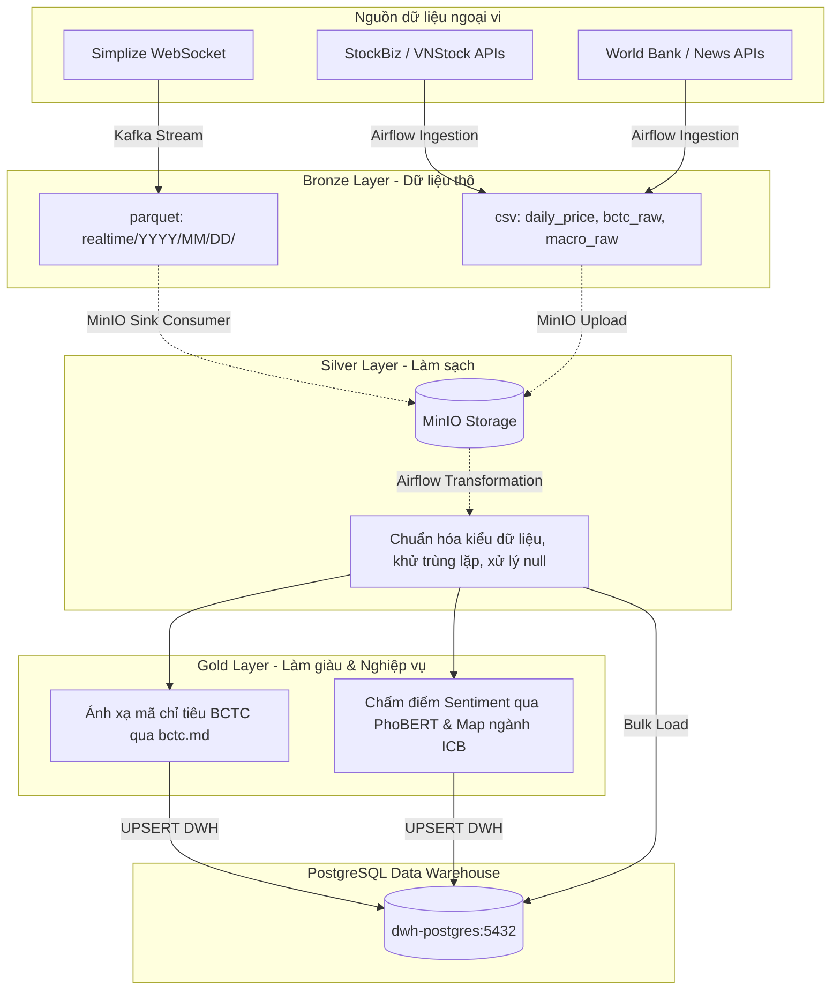
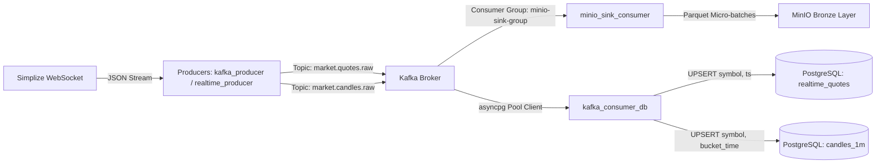
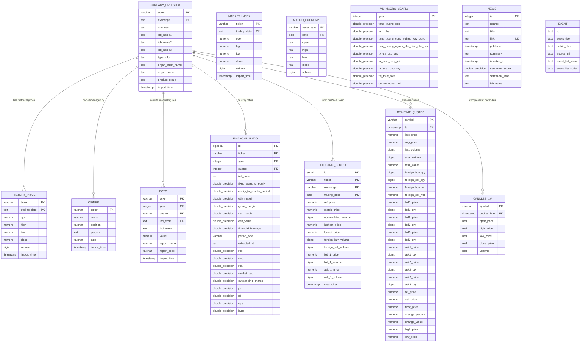

# 📊 TÀI LIỆU PHÂN TÍCH LUỒNG DỮ LIỆU (DATA FLOW)

Tài liệu này mô tả chi tiết luồng di chuyển, xử lý và lưu trữ dữ liệu trong hệ thống phân tích chứng khoán Việt Nam. Hệ thống kết hợp giữa **luồng streaming thời gian thực (Apache Kafka)** phục vụ bảng giá khớp lệnh từng giây và **luồng batch định kỳ (Apache Airflow)** phục vụ đồng bộ dữ liệu tài chính, vĩ mô và phân tích cảm xúc tin tức bằng AI.

---

## Danh Mục Các Đầu Mục Dữ Liệu (Data Categories)

Hệ thống quản lý và thu thập 4 nhóm đầu mục dữ liệu cốt lõi:
1. **Dữ liệu Giao dịch & Giá Chứng khoán (Market Data):**
   - Giá khớp lệnh thời gian thực từng giây (Real-time ticks/quotes).
   - Biểu đồ nến kỹ thuật 1 phút (1-minute candles).
   - Giá đóng phiên EOD (End of Day/History price) lịch sử.
   - Sổ lệnh bảng điện đóng phiên (Electric board snapshot).
   - Điểm số của chỉ số Index (VNINDEX, HNXINDEX, VN30, UPCOM).
2. **Dữ liệu Tài chính & Doanh nghiệp (Financial & Corporate Data):**
   - Báo cáo tài chính (BCTC) doanh nghiệp bao gồm: Bảng Cân đối kế toán (BL), Kết quả hoạt động kinh doanh (IS), Lưu chuyển tiền tệ trực tiếp & gián tiếp (CF).
   - Chỉ số tài chính cơ bản và nâng cao (P/E, P/B, EPS, ROA, ROE, đòn bẩy, thanh toán nhanh, thanh toán tiền mặt, vòng quay tồn kho...).
   - Tổng quan hồ sơ công ty (ngày thành lập, phân ngành ICB cấp 1-2-3, mô tả kinh doanh, sàn giao dịch).
   - Ban lãnh đạo, nhân sự chủ chốt, danh sách sở hữu của cổ đông lớn (Owner/People).
   - Các sự kiện doanh nghiệp (chia cổ tức, phát hành thêm cổ phiếu, đại hội cổ đông).
3. **Dữ liệu Vĩ mô & Quốc tế (Macroeconomics & Global Market):**
   - Giá hàng hóa & Chỉ số quốc tế (Vàng thế giới Gold Futures, dầu thô WTI, chỉ số Dow Jones).
   - Tỷ giá ngoại tệ chủ chốt (USD/VND, USD/CNY, EUR/USD, chỉ số DXY).
   - Lợi suất trái phiếu chính phủ Mỹ kỳ hạn 10 năm.
   - Chỉ số vĩ mô năm Việt Nam (Tăng trưởng GDP, lạm phát CPI, FDI, dự trữ ngoại hối, cung tiền M2...).
4. **Dữ liệu Tin tức & Phân tích Cảm xúc (News & NLP Sentiment):**
   - Bản tin tài chính tổng hợp và tin tức doanh nghiệp từ CafeF, Vietstock.
   - Điểm số tâm lý tin tức (Tích cực, Trung lập, Tiêu cực) chấm điểm qua PhoBERT AI.
   - Phân loại ngành bài báo theo ICB cấp 2.

---

## 1. Tổng Quan Kiến Trúc Medallion Lakehouse

Dự án áp dụng mô hình kiến trúc **Medallion Lakehouse** kết hợp giữa lưu trữ Object Storage (**MinIO**) và cơ sở dữ liệu quan hệ tối ưu hóa vector (**PostgreSQL DWH**) với 3 lớp xử lý dữ liệu:

### 1.1. Chi tiết các Lớp Medallion
*   **Bronze Layer (Lớp Thô - Raw):** Lưu trữ dữ liệu thô nguyên bản thu thập trực tiếp từ các nguồn WebSocket và API. Dữ liệu được lưu trữ trên MinIO dưới dạng file CSV (cho batch) hoặc Parquet (cho realtime) phân chia theo thư mục ngày/giờ.
*   **Silver Layer (Lớp Làm sạch - Cleaned):** Đọc dữ liệu từ Bronze, thực hiện chuẩn hóa kiểu số (ví dụ: định dạng tiền tệ tiếng Việt `1.234.567.000` thành số thực `1234567000.0`), khử trùng lặp, lọc các ticker lỗi và định hình lại cấu trúc dữ liệu (Melt/Pivot).
*   **Gold Layer (Lớp Nghiệp vụ/Tổng hợp):** Làm giàu dữ liệu thông qua ánh xạ mã chỉ tiêu tài chính chung (`ind_code` từ cấu hình `bctc.md`) hoặc chạy mô hình học sâu **PhoBERT** để gán nhãn tâm lý tin tức và phân loại nhóm ngành cấp 2 (chuẩn ICB). Dữ liệu Gold đã sẵn sàng phục vụ và được nạp trực tiếp vào PostgreSQL DWH.

### 1.2. Hệ Thống Object Storage MinIO
Hệ thống sử dụng MinIO làm Data Lake chính để lưu giữ các file dữ liệu thô (Bronze) và dữ liệu trung gian đã chuẩn hóa (Silver):
- **Bucket lưu trữ mặc định:** `thongtin-congty-va-bctc`
- **Quy hoạch cây thư mục và Định dạng tệp:**
  - `realtime/YYYY-MM-DD/`: Chứa các tệp tin lưu trữ khớp lệnh thực tế từng giây ở định dạng **Parquet** (Ví dụ: `quotes_1772635467123.parquet`) được nén cột giúp tối ưu hóa không gian lưu trữ và tăng tốc độ đọc dữ liệu sau này.
  - `daily_price/YYYY-MM-DD/`: Chứa các tệp CSV giá đóng cửa của các mã theo từng lô.
  - `bctc_raw/YYYY-MM-DD/`: Báo cáo tài chính thô dạng CSV lấy về từ API.
  - `bctc_luong2/YYYY-MM-DD_HH:MM:SS:mmm/`: BCTC đã được làm sạch hoàn toàn, ánh xạ chỉ tiêu thành mã thống nhất. Ví dụ: `bctc_luong2_y2026_q1.csv`.
  - `fin_ratio_v2/YYYY-MM-DD_HH:MM:SS:mmm/`: Chỉ số tài chính v2 chuyên sâu được làm sạch.
  - `news/YYYY-MM-DD/`: Tin tức thô cào hàng giờ dạng CSV.
  - `macro_economy/YYYY-MM-DD/`: Chỉ số giá dầu, giá vàng, Dow Jones thế giới dạng CSV.
  - `global_index/YYYY-MM-DD/`: Tỷ giá hối đoái quốc tế dạng CSV.
  - `vn_macro_yearly/YYYY-MM-DD/`: Dữ liệu vĩ mô năm của Việt Nam.
  - `index_price/YYYY-MM-DD/`: Điểm số các chỉ số chứng khoán chính dạng CSV.
  - `company_overview/YYYY-MM-DD/` và `company_hr/YYYY-MM-DD/`: Hồ sơ và cơ cấu nhân sự ban lãnh đạo công ty dạng CSV.
- **Chính sách Nén và Tối ưu (Compression & Retention Policy):**
  - Luồng Real-time được nén Parquet trực tiếp tại bộ thu consumer.
  - DAG `csv_to_parquet` hoạt động để chuyển đổi nén toàn bộ các CSV lịch sử cũ lưu trên MinIO sang Parquet giúp tiết kiệm dung lượng lưu trữ đĩa vật lý của Data Lakehouse.

---

## 2. Luồng Streaming Thời Gian Thực (Kafka Pipeline)

Dành riêng cho bảng điện tử (Price Board) và dữ liệu khớp lệnh thời gian thực, hệ thống thiết lập luồng streaming liên tục để xử lý dữ liệu tick-by-tick hiệu năng cao:

### 2.1. Thiết kế Hướng Sự kiện (Event-Driven Architecture)
Hệ thống sử dụng Apache Kafka làm trục xương sống kết nối giữa Client cào dữ liệu thô (WebSocket) và các bộ tiêu thụ (Consumers) ghi nhận dữ liệu vào hồ lưu trữ (MinIO Lakehouse) và cơ sở dữ liệu quan hệ (PostgreSQL DWH):

---

### 2.2. Chi tiết các thành phần trong Luồng Streaming

#### 1. WebSocket Client / Producers (Bộ phát dữ liệu)
*   **`kafka_producer.py` (Producer chính):**
    *   Kết nối bất đồng bộ đến Simplize WebSocket (`wss://stream2.simplize.vn/ws`) và gửi gói đăng ký sự kiện `quotes` của toàn bộ các mã cổ phiếu đang niêm yết trên các sàn HOSE, HNX, UPCOM.
    *   Khi nhận gói tin JSON chứa thông tin báo giá (bao gồm giá khớp lệnh, khối lượng, nước ngoài mua/bán, 3 mức giá bid/ask tốt nhất), tiến hành đẩy bản ghi phẳng vào Kafka topic `market.quotes.raw` với khóa là mã chứng khoán (`symbol`).
    *   Đồng thời, tự động gom nhóm (aggregation) các tick giá trong vòng 60 giây để tạo thành nến 1 phút (1-minute OHLCV). Khi hết chu kỳ phút, nến cũ sẽ được flush sang Kafka topic `market.candles.raw` và giải phóng bộ nhớ.
*   **`realtime_producer.py` (Producer dự phòng):**
    *   Hoạt động như một tiến trình độc lập, tự động lấy danh sách mã chứng khoán niêm yết từ `vnstock.Listing()`, subscribe Simplize WS, đính kèm dấu thời gian `ingested_at` và đẩy vào topic `market.quotes.raw`.

#### 2. Kafka Topics (Bộ lưu trữ phân tán tạm thời)
*   **`market.quotes.raw`:** Topic lưu trữ dòng dữ liệu khớp lệnh thô từng giây. Việc phân vùng dữ liệu dựa trên khóa `symbol` giúp đảm bảo thứ tự thời gian của các giao dịch trên cùng một mã cổ phiếu luôn được giữ nguyên khi ghi nhận.
*   **`market.candles.raw`:** Topic chứa dữ liệu nến 1 phút đã qua xử lý, dùng cho các ứng dụng vẽ biểu đồ kỹ thuật (charts) thời gian thực của Web App.

#### 3. Consumers (Bộ tiêu thụ & Lưu trữ dữ liệu)
*   **`minio_sink_consumer.py` (Bronze Layer - Object Storage):**
    *   Đọc dữ liệu từ topic `market.quotes.raw` thuộc nhóm tiêu thụ `minio-sink-group`.
    *   Áp dụng cơ chế **Micro-batching**: dữ liệu được tích lũy vào bộ đệm cho đến khi đạt đủ `20,000` bản ghi hoặc thời gian gom vượt quá `10 phút` (600 giây).
    *   Khi đạt điều kiện, bộ đệm được chuyển thành Pandas DataFrame, chuyển tiếp thành bảng PyArrow và ghi xuống MinIO dưới dạng file Parquet nén cột tối ưu theo định dạng đường dẫn phân vùng ngày: `realtime/YYYY-MM-DD/quotes_{ms_timestamp}.parquet`.
    *   *Cơ chế dừng tự động:* Consumer liên tục kiểm tra múi giờ Việt Nam. Sau `15:00` hàng ngày (khi thị trường đóng cửa), consumer sẽ tự động xả nốt (flush) các bản ghi còn lại trong bộ đệm lên MinIO và thoát tiến trình.
*   **`kafka_consumer_db.py` (Realtime DWH Layer - Database):**
    *   Sử dụng thư viện `asyncpg` để lập pool kết nối bất đồng bộ hiệu năng cao, ghi đè trực tiếp dữ liệu vào PostgreSQL.
    *   Đọc từ topic `market.quotes.raw` &rarr; chèn batch vào bảng `realtime_quotes` với chiến lược `ON CONFLICT (symbol, ts) DO UPDATE` để cập nhật trạng thái bảng điện tử tức thì.
    *   Đọc từ topic `market.candles.raw` &rarr; chèn batch vào bảng `candles_1m` với chiến lược `ON CONFLICT (symbol, bucket_time) DO UPDATE`.

---

## 3. Luồng Batch & Đồng bộ DWH (Airflow Pipeline)

Lớp điều phối dữ liệu định kỳ (Batch) và đồng bộ DWH được quản lý tự động bởi **Apache Airflow** chạy Celery Executor, cho phép phân tán các tác vụ nặng (như cào dữ liệu lịch sử lớn và chạy AI Sentiment phân tích tâm lý tin tức) trên các Celery Workers hoạt động song song.

```mermaid
gantt
    title Lịch trình hoạt động của 21 Airflow DAGs (Thiết kế dọc không chồng chéo)
    dateFormat HH:mm
    axisFormat %H:%M
    todayMarker off

    %% ==========================================
    section 1. Real-time & Hàng giờ (Intra-day & Hourly)
    minio_to_db_sync (Sync mỗi 2h từ 08.00 đến 18.00)               :active, 08:00, 18:00
    market_index_price (Sync giá Index mỗi giờ từ 09.00 đến 15.00)  :active, 09:00, 15:00
    daily_news (Cào tin tức mỗi 2h từ 09.00 đến 19.00)              :active, 09:00, 19:00
    realtime_quotes_minio_to_db_sync (Sync Realtime từ 09.00 đến 17.00) :active, 09:00, 17:00
    news_sentiment_sync (NLP và Cảm xúc mỗi 2h từ 10.00 đến 20.00)   :active, 10:00, 20:00

    %% ==========================================
    section 2. Hàng ngày (Daily EOD & Morning)
    history_price (Giá lịch sử toàn bộ mã lúc 00.00)               : 00:00, 00:30
    orderbook_backto_minio_parquet (Nén và Lưu kho Realtime lúc 02.00) : 02:00, 03:00
    global_index (Tỷ giá và Trái phiếu thế giới lúc 08.00)           : 08:00, 08:30
    macro_eco (Giá dầu, vàng và DowJones lúc 08.00)                  : 08:00, 08:30
    electric_board_daily (Bảng điện đóng phiên lúc 15.00)          : 15:00, 15:30
    daily_price (Giá chốt phiên khớp lệnh EOD lúc 16.00)           : 16:00, 16:30

    %% ==========================================
    section 3. Định kỳ (Tuần / Tháng / Quý)
    company_overview (Hồ sơ tổng quan DN đầu quý lúc 00.00)     : 00:00, 01:00
    company_hr (Ban lãnh đạo và Sở hữu đầu quý lúc 00.00)        : 00:00, 01:00
    dl_bctc (Báo cáo tài chính thô đầu tháng lúc 00.00)        : 00:00, 01:00
    bctc_luong_2 (BCTC bctc_luong2 sạch đầu tháng lúc 01.00)   : 01:00, 03:00
    fin_ratio_v2 (Chỉ số tài chính v2 đầu tháng lúc 02.00)     : 02:00, 04:00
    financial_ratios (Chỉ số tài chính v1 Chủ Nhật lúc 02.00)  : 02:00, 03:00
    vn_macro_per_year (Vĩ mô VN từ World Bank Thứ 7 lúc 09.00)  : 09:00, 10:00

    %% ==========================================
    section 4. Chạy thủ công / Bảo trì (Manual)
    backup_db (Truncate và Reload toàn bộ DWH)                   : 00:00, 23:59
    csv_to_parquet (Nén tệp tin CSV sang Parquet)               : 00:00, 23:59
    minio_to_db_manual_sync (Đồng bộ thủ công theo ngày)        : 00:00, 23:59
```

---

### 3.1. Nhóm Dữ liệu Real-time & Hàng giờ (Intra-day & Hourly)

Nhóm các DAGs phục vụ dữ liệu thời gian thực và cập nhật liên tục trong phiên giao dịch của thị trường tài chính:

*   **`realtime_quotes_minio_to_db_sync` (`realtime_quotes_sync.py`)**
    *   *Tần suất:* Chạy hàng giờ từ `09:00` đến `17:00` từ Thứ 2 đến Thứ 6 (múi giờ Việt Nam).
    *   *Tasks:* `sync_realtime_quotes` &rarr; `summary_report` &rarr; `cleanup_old_data`.
    *   *Luồng dữ liệu:* Đọc các file Parquet thời gian thực được gom bởi Kafka sink consumer tại folder `realtime/YYYY-MM-DD/` trên MinIO.
    *   *DWH Target:* Thực hiện `UPSERT` vào bảng `hethong_phantich_chungkhoan.realtime_quotes` dựa trên tổ hợp khóa chính `(symbol, ts)`. Task `cleanup_old_data` tự động xóa dữ liệu cũ hơn 1 ngày (chỉ giữ lại dữ liệu ngày hiện tại N và ngày trước đó N-1).
*   **`market_index_price` (`dl_market_index_price.py`)**
    *   *Tần suất:* Chạy hàng giờ từ `09:00` đến `15:00` hàng ngày.
    *   *Tasks:* `persist_index_price`.
    *   *Luồng dữ liệu:* Gọi API lấy giá chỉ số chứng khoán thị trường (VN-Index, HNX-Index, UPCoM-Index, v.v.).
    *   *MinIO Target:* Lưu trữ file CSV thô tại `index_price/YYYY-MM-DD/index_price_{timestamp}.csv`. Đồng bộ vào bảng `index_price` của PostgreSQL DWH thông qua `minio_to_db_sync`.
*   **`daily_news` (`dl_news.py`)**
    *   *Tần suất:* Chạy mỗi 2 tiếng từ `09:00` đến `19:00` hàng ngày.
    *   *Tasks:* `ingest_news`.
    *   *Luồng dữ liệu:* Cào tin tức thị trường vĩ mô và tin tức doanh nghiệp từ các báo tài chính lớn.
    *   *MinIO Target:* Lưu trữ tệp tin CSV thô tại `news/YYYY-MM-DD/news_{timestamp}.csv`.
*   **`news_sentiment_sync` (`news_sentiment_sync.py`)**
    *   *Tần suất:* Chạy mỗi 2 tiếng từ `10:00` đến `20:00` hàng ngày.
    *   *Tasks:* `sync_news_from_minio` &rarr; `fill_sentiment_scores` &rarr; `fill_icb_names` &rarr; `summary_report`.
    *   *Luồng dữ liệu & Nghiệp vụ (Gold):*
        1. Đọc tin tức mới từ thư mục `news/` trên MinIO và nạp (`UPSERT`) vào bảng `hethong_phantich_chungkhoan.news` dựa trên khóa `(source, published_date, title)`.
        2. Chạy mô hình ngôn ngữ **PhoBERT** (`wonrax/phobert-base-vietnamese-sentiment`) phân tích cảm xúc tiêu đề & tóm tắt sang nhãn: Tích cực (Positive), Trung lập (Neutral), Tiêu cực (Negative), quy đổi thành điểm số định lượng từ `-100` đến `100`.
        3. Sử dụng mô hình Regex Matching đối khớp từ khóa để tự động liên kết bài báo với nhóm ngành cấp 2 (theo chuẩn ICB - ví dụ: Bất động sản, Ngân hàng, Thép...).
*   **`minio_to_db_sync` (`minio_to_db_sync.py`)**
    *   *Tần suất:* Chạy định kỳ mỗi 2 tiếng từ `08:00` đến `18:00` hàng ngày.
    *   *Tasks:* Celery Workers thực thi song song các task độc lập không phụ thuộc chéo:
        - `sync_bctc`: Đồng bộ báo cáo tài chính đã làm sạch từ `bctc_luong2/` &rarr; `UPSERT` bảng `bctc`.
        - `sync_daily_price`: Đồng bộ giá cuối ngày từ `daily_price/` &rarr; `APPEND/UPSERT` bảng `history_price`.
        - `sync_financial_ratio`: Đồng bộ chỉ số tài chính từ `fin_ratio_v2/` &rarr; `UPSERT` bảng `financial_ratio` theo khóa `(ticker, year, quarter)`.
        - `sync_global_index`: Đồng bộ tỷ giá/trái phiếu thế giới từ `global_index/` &rarr; `APPEND` bảng `global_index`.
        - `sync_index_price`: Đồng bộ chỉ số VN-Index/HNX từ `index_price/` &rarr; `APPEND` bảng `index_price`.
        - `sync_macro_economy`: Đồng bộ giá vàng/dầu thô từ `macro_economy/` &rarr; `APPEND` bảng `macro_economy`.
        - `sync_overview`: Đồng bộ hồ sơ doanh nghiệp &rarr; `UPSERT` bảng `overview` theo `ticker`.
        - `sync_people`: Đồng bộ cơ cấu ban quản trị &rarr; `DELETE` toàn bộ và `INSERT` mới bảng `people`.
        - `sync_electric_board`: Đồng bộ bảng điện đóng phiên &rarr; `UPSERT` bảng `electric_board`.
        - `sync_vn_macro_yearly`: Đồng bộ chỉ số vĩ mô năm Việt Nam &rarr; Ghi đè (`TRUNCATE + INSERT`) bảng `vn_macro_yearly`.
        - `summary_report`: Thu thập trạng thái của tất cả các task và báo cáo tổng hợp.

---

### 3.2. Nhóm Dữ liệu Hàng ngày (Daily EOD & Morning Runs)

Nhóm các DAGs thực thi một lần mỗi ngày vào sáng sớm hoặc cuối ngày sau khi thị trường đóng cửa:

*   **`history_price` (`dl_history_price.py`)**
    *   *Tần suất:* Chạy hàng ngày lúc `00:00`.
    *   *Tasks:* `ingest_history_price`.
    *   *Luồng dữ liệu:* Thu thập toàn bộ lịch sử giá giao dịch của các cổ phiếu từ API nguồn.
    *   *MinIO Target:* Lưu trữ CSV thô tại `history_price/YYYY-MM-DD/history_price_{timestamp}.csv`.
*   **`orderbook_backto_minio_parquet` (`orderbook_to_parquet_minio.py`)**
    *   *Tần suất:* Chạy hàng ngày lúc `02:00`.
    *   *Tasks:* `extract_old_data` &rarr; `save_to_minio` &rarr; `delete_archived_data` &rarr; `summary_report`.
    *   *Luồng dữ liệu:* Truy vấn dữ liệu realtime khớp lệnh cũ hơn 1 ngày từ bảng `realtime_quotes` trong PostgreSQL DWH, nén chất lượng cao sang định dạng Parquet và ghi nhận vào folder lưu trữ lâu dài `orderbook_parquet/` của MinIO. Sau đó thực hiện xóa dữ liệu đã lưu trữ khỏi bảng DB đích để tối ưu hiệu suất truy vấn.
*   **`global_index` (`dl_global_index.py`)**
    *   *Tần suất:* Chạy hàng ngày lúc `08:00`.
    *   *Tasks:* Chạy song song 5 luồng: `ingest_usd_vnd`, `ingest_dxy_index`, `ingest_usd_cny`, `ingest_eur_usd`, `ingest_us_bond_10y`.
    *   *Luồng dữ liệu:* Gọi API thu thập tỷ giá ngoại tệ toàn cầu và lợi suất trái phiếu chính phủ Mỹ kỳ hạn 10 năm.
    *   *MinIO Target:* Lưu trữ tệp CSV thô tại `global_index/YYYY-MM-DD/global_index_{timestamp}.csv`.
*   **`macro_eco` (`dl_macro_eco.py`)**
    *   *Tần suất:* Chạy hàng ngày lúc `08:00`.
    *   *Tasks:* Chạy song song 3 luồng: `ingest_gold_price`, `ingest_oil_price`, `ingest_dowjones_index`.
    *   *Luồng dữ liệu:* Thu thập giá giao dịch vàng tương lai (Gold Futures), dầu thô WTI (WTI Crude Oil) và chỉ số chứng khoán Dow Jones thông qua Yahoo Finance API.
    *   *MinIO Target:* Lưu trữ CSV thô tại `macro_economy/YYYY-MM-DD/macro_economy_{timestamp}.csv`.
*   **`electric_board_daily` (`dl_electric_board.py`)**
    *   *Tần suất:* Chạy lúc `15:00` từ Thứ 2 đến Thứ 6 hàng tuần (ngay sau khi đóng phiên giao dịch).
    *   *Tasks:* `ingest_electric_board`.
    *   *Luồng dữ liệu:* Thu thập thông số cuối phiên của bảng điện tử khớp lệnh Việt Nam.
    *   *MinIO Target:* Lưu CSV tại `electric_board/YYYY-MM-DD/electric_board_{timestamp}.csv`.
*   **`daily_price` (`dl_dailly_price.py`)**
    *   *Tần suất:* Chạy lúc `16:00` từ Thứ 2 đến Thứ 6 hàng tuần.
    *   *Tasks:* `ingest_daily_price`.
    *   *Luồng dữ liệu:* Gọi API lấy giá khớp lệnh EOD (End of Day) cuối ngày của các cổ phiếu.
    *   *MinIO Target:* Lưu CSV thô phân chia theo lô mã tại `daily_price/YYYY-MM-DD/batch_X.csv`.

---

### 3.3. Nhóm Dữ liệu Định kỳ (Weekly, Monthly, Quarterly)

Nhóm các DAGs phục vụ dữ liệu tài chính vĩ mô và chỉ số doanh nghiệp có tính chu kỳ dài hạn:

*   **`vn_macro_per_year` (`dl_vn_macro_per_year.py`)**
    *   *Tần suất:* Chạy lúc `09:00` Thứ Bảy hàng tuần.
    *   *Tasks:* `ingest_vn_macro_yearly`.
    *   *Luồng dữ liệu:* Gọi API Ngân hàng Thế giới (World Bank) thu thập 16 chỉ số kinh tế vĩ mô cốt lõi của Việt Nam qua các năm (tăng trưởng GDP, lạm phát CPI, sản lượng công nghiệp...).
    *   *MinIO Target:* Lưu trữ CSV thô tại `vn_macro_yearly/YYYY-MM-DD/vn_macro_yearly_{timestamp}.csv`.
*   **`financial_ratios` (`dl_financial_ratios.py`)**
    *   *Tần suất:* Chạy lúc `02:00` Chủ Nhật hàng tuần.
    *   *Tasks:* `ingest_financial_ratios`.
    *   *Luồng dữ liệu:* Lấy các chỉ số tài chính tính sẵn (P/E, EPS, ROA, ROE, P/B...) từ thư viện VNStock.
    *   *MinIO Target:* Lưu CSV thô tại `financial_ratios/YYYY-MM-DD/financial_ratios_{timestamp}.csv`. Đồng bộ ghi đè (`REPLACE`) vào bảng `financial_ratio` trong DWH.
*   **`bctc` (`dl_bctc.py`)**
    *   *Tần suất:* Chạy lúc `00:00` ngày 1 hàng tháng (`@monthly`).
    *   *Tasks:* `ingest_bctc`.
    *   *Luồng dữ liệu:* Tải báo cáo tài chính thô của các doanh nghiệp niêm yết từ nguồn cung cấp.
    *   *MinIO Target:* Lưu CSV thô tại `bctc_raw/YYYY-MM-DD/bctc_{timestamp}.csv`.
*   **`bctc_luong_2` (`dl_bctc_luong_2.py`)**
    *   *Tần suất:* Chạy lúc `01:00` ngày 1 hàng tháng (`@monthly`) hoặc kích hoạt thủ công kèm tham số (năm, quý, kích thước lô cào).
    *   *Tasks:* `get_partition_folder` &rarr; `run_all_in_one`.
    *   *Luồng dữ liệu & Biến đổi nghiệp vụ (Silver/Gold):*
        1. Gọi đa luồng `ThreadPoolExecutor` (mặc định 8 workers song song) cào đồng thời dữ liệu 4 bảng báo cáo tài chính (Cân đối kế toán - BL, Kết quả kinh doanh - IS, Lưu chuyển tiền tệ trực tiếp & gián tiếp - CF) từ StockBiz.
        2. Chuyển đổi định dạng cột ngang (các năm/quý) sang định dạng dọc (long-format), làm sạch tên chỉ tiêu thô.
        3. Ánh xạ chuẩn hóa tên chỉ tiêu tài chính thô của Việt Nam thành mã chỉ tiêu thống nhất (`ind_code`) thông qua danh mục cấu hình [bctc.md](file:///d:/project_vnstock/data_pipeline/etl/airflow/plugins/logic/bctc.md).
        4. Đối với bảng Cân đối kế toán (BL), nhân giá trị với hệ số `1.000.000` (do dữ liệu gốc của StockBiz bị rút gọn).
    *   *MinIO Target:* Lưu CSV sạch lên `bctc_luong2/YYYY-MM-DD_HH:MM:SS:mmm/bctc_luong2_y{year}_q{quarter}.csv`. Đồng bộ bảng `bctc` trong DWH qua `minio_to_db_sync` (chế độ `UPSERT` theo khóa `(ticker, year, quarter, ind_code)`).
*   **`fin_ratio_v2` (`dl_fin_ratio_v2.py`)**
    *   *Tần suất:* Chạy lúc `02:00` ngày 1 hàng tháng (`@monthly`).
    *   *Tasks:* `get_partition_folder` &rarr; `run_all_in_one`.
    *   *Luồng dữ liệu:* Thu thập dữ liệu chỉ số tài chính doanh nghiệp từ SMONEY và Vietstock, thực hiện tính toán và hợp nhất giá trị EPS/BVPS.
    *   *MinIO Target:* Ghi nhận CSV sạch lên `fin_ratio_v2/YYYY-MM-DD_HH:MM:SS:mmm/fin_ratio_v2.csv`. Đồng bộ bảng `financial_ratio` trong DWH qua `minio_to_db_sync` (chế độ `UPSERT` theo khóa `(ticker, year, quarter)`).
*   **`company_overview` (`dl_overview.py`)**
    *   *Tần suất:* Chạy lúc `00:00` ngày đầu tiên của các tháng 1, 4, 7, 10 hàng năm (chu kỳ hàng quý).
    *   *Tasks:* `ingest_overview`.
    *   *Luồng dữ liệu:* Thu thập hồ sơ tổng quan thông tin pháp lý, ngành ICB và mô tả kinh doanh của doanh nghiệp.
    *   *MinIO Target:* Lưu CSV thô tại `company_overview/YYYY-MM-DD/company_overview_{timestamp}.csv`. Đồng bộ bảng `overview` qua `minio_to_db_sync` (chế độ `UPSERT` khóa `ticker`).
*   **`company_hr` (`dl_people.py`)**
    *   *Tần suất:* Chạy lúc `00:00` ngày đầu tiên của các tháng 1, 4, 7, 10 hàng năm (chu kỳ hàng quý).
    *   *Tasks:* `people_minio`.
    *   *Luồng dữ liệu:* Thu thập danh sách ban điều hành, cổ đông lớn và nhân sự chủ chốt của doanh nghiệp.
    *   *MinIO Target:* Lưu CSV thô tại `company_hr/YYYY-MM-DD/company_hr_{timestamp}.csv`. Đồng bộ bảng `people` qua `minio_to_db_sync` (chế độ `DELETE_INSERT` - xóa sạch bản ghi cũ của ticker và chèn mới).

---

### 3.4. Nhóm Chạy thủ công / Bảo trì (Manual & Maintenance)

Các DAGs đặc biệt không có lịch trình chạy tự động, chỉ được kích hoạt bởi quản trị viên qua Airflow UI để quản lý hệ thống hoặc khắc phục sự cố:

*   **`minio_to_db_manual_sync` (`minio_to_db_manual_sync.py`)**
    *   *Tasks:* `validate_and_prepare` &rarr; `list_partition_files` &rarr; `sync_to_database` &rarr; `summary_report`.
    *   *Luồng dữ liệu:* Đồng bộ lại dữ liệu thủ công từ một phân vùng thư mục cụ thể trên MinIO vào PostgreSQL DWH theo cấu hình tham số truyền vào qua Airflow UI.
*   **`backup_db` (`backup_db.py`)**
    *   *Tasks:* `truncate_all_tables` &rarr; Gặp nhánh chạy song song (`sync_bctc`, `sync_daily_price`, `sync_history_price`, `sync_financial_ratio`, `sync_macro_economy`, `sync_global_index`, `sync_index_price`, `sync_news`, `sync_overview`, `sync_people`, `sync_electric_board`) &rarr; `remove_all_duplicates` &rarr; `summary_report`.
    *   *Quy trình thực thi:*
        1. Gọi SQL thực hiện TRUNCATE sạch toàn bộ dữ liệu hiện có trong DWH (schema `hethong_phantich_chungkhoan`), loại trừ bảng mapping chỉ tiêu.
        2. Quét toàn bộ lịch sử phân vùng thư mục trên MinIO từ trước tới nay.
        3. Thực hiện bulk-load khôi phục lại toàn bộ dữ liệu vào cơ sở dữ liệu.
        4. Chạy task loại bỏ trùng lặp và ghi nhận log báo cáo.
*   **`csv_to_parquet` (`csv_to_parquet.py`)**
    *   *Tasks:* Chạy song song 3 luồng: `compress_history_price`, `compress_financial_ratio`, `compress_bctc` &rarr; `summary_report`.
    *   *Luồng dữ liệu:* Quét các tệp CSV lịch sử cũ có kích thước lớn lưu trên MinIO, nén chuyển đổi định dạng tối ưu sang Parquet để giảm thiểu không gian lưu trữ Object Storage.

---
*Tài liệu được cập nhật tự động khớp với cấu hình thực tế của Airflow DAGs trong hệ thống.*

---

## 4. Sơ Đồ Quan Hệ Thực Thể (Entity Relationship Diagram - ERD)

Dưới đây là sơ đồ ER mô tả mối quan hệ giữa các bảng dữ liệu trong schema `hethong_phantich_chungkhoan` của cơ sở dữ liệu PostgreSQL DWH. Bảng `company_overview` đóng vai trò là thực thể trung tâm quản lý các mã chứng khoán (`ticker`), các bảng dữ liệu lịch sử giá, báo cáo tài chính và sổ lệnh liên kết thông qua khóa ngoại hoặc trường liên kết `ticker`/`symbol`:

